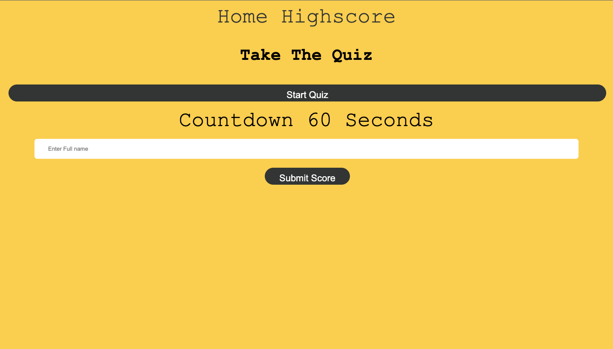
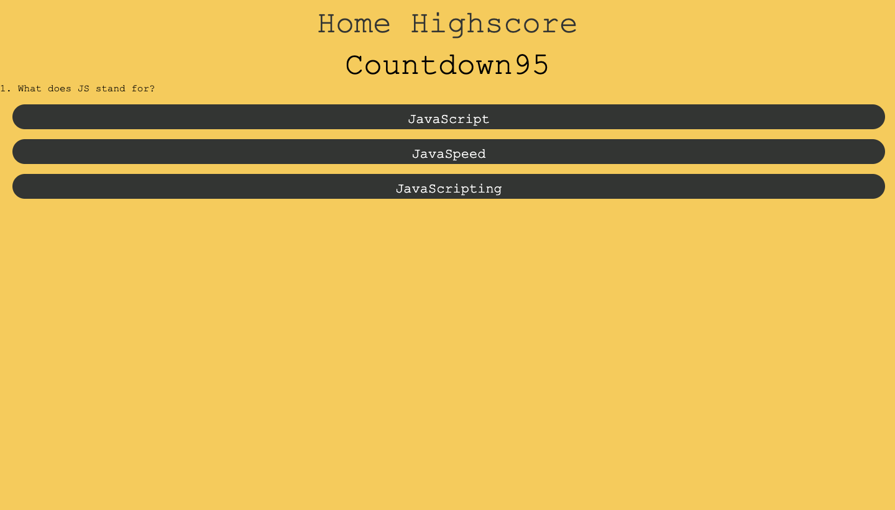

# Title

code-quiz

# Description

A code quiz where the user clicks on the start quiz button and is presented with a set of multiple choice questions.
The user is timed and if they click the wrong answer the timer is reduced by 5 seconds. Once they click the answer they go onto the next question and once they finish the set of questions they are presented with a highscores submission page which is stored in the local storage.

# Languages Used

I have used HTML, CSS and JavaScript to create my quiz to dynamically render the questions and highscores page on the page.

# Link to URL

Click the link to view the website [here]()

# Images Of Dynamic Page

